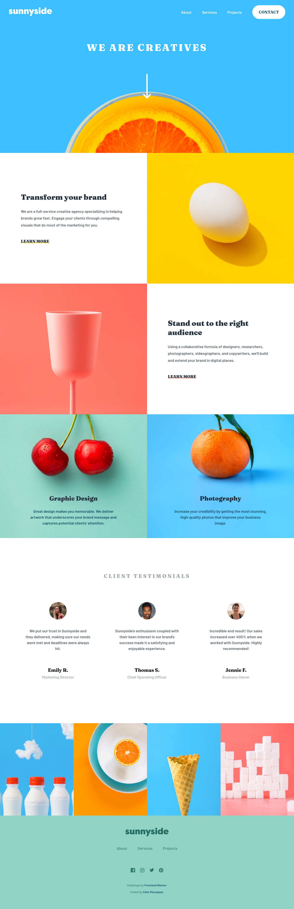

# Frontend Mentor - Sunnyside agency landing page solution

This is a solution to the [Sunnyside agency landing page challenge on Frontend Mentor](https://www.frontendmentor.io/solutions/landing-page-made-using-gulpjs-and-sass-IovLIOtqz). Frontend Mentor challenges help you improve your coding skills by building realistic projects.

## Table of contents

- [Frontend Mentor - Sunnyside agency landing page solution](#frontend-mentor---sunnyside-agency-landing-page-solution)
  - [Table of contents](#table-of-contents)
  - [Overview](#overview)
    - [The challenge](#the-challenge)
    - [Screenshot](#screenshot)
    - [Links](#links)
  - [My process](#my-process)
    - [Built with](#built-with)
    - [What I learned](#what-i-learned)
    - [Continued development](#continued-development)
    - [Useful resources](#useful-resources)
  - [Author](#author)
  - [Acknowledgments](#acknowledgments)
  
## Overview

### The challenge

Users should be able to:

- View the optimal layout for the site depending on their device's screen size
- See hover states for all interactive elements on the page
- toggle mobile menu for mobile size

### Screenshot



### Links

- Solution URL: [Add solution URL here](https://your-solution)
- Live Site URL: [Add live site URL here](https://sunnyside-lp-felix.netlify.app/)

## My process
- Tried to experience some stuff while watching [coder coder's](https://www.youtube.com/c/TheCoderCoder) tutorial on how she usually approach projects. I started by taking notes, like what she did in her video and tried to research some useful stuff that could help me with the project. I've also tried the mobile-first workflow. 

### Built with

- Semantic HTML5 markup
- SASS
- Gulp
- Flexbox
- Mobile-first workflow

### What I learned

I've learned how to approach a project more clearly and organise stuff to maximize the productivity while coding. I really love working with gulp, and its plugins. I've also learn how to use the `clamp` property for css and also tried to use the BEM approach for this project. 

```css
.learn-btn {
  font-size: clamp(14px, 3vw, 18px);
}
```
### Continued development

I'm still trying to improve myself working with mobile-first workflow.

### Useful resources

- [Resource #1](https://kinsta.com/blog/responsive-web-design/#set-your-media-query-ranges-responsive-breakpoints) - This helped me for being more comfortable with setting responsive breakpoints for a project.

## Author

- Frontend Mentor - [@felixmacaspac](https://www.frontendmentor.io/profile/felixmacaspac)

## Acknowledgments

Thanks for the people in slack who helped me with this project. especially DJ & avatarfreak. I had some problems while deploying and they put an effort helping me figuring out what's the main problem 🤙
